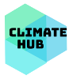

# Climate Hub

A MERN stack application to track climate change of US cities.

## Technologies Used

- react - 16.12
- react-redux - 7.20
- redux-thunk - 2.3.0
- react-router-dom - 5.1.2
- express - 4.17.1
- mongoose - 5.9.1
- chart.js - 2.9.3
- react-chartjs-2 - 2.9.0
- react-places-autocomplete - 7.2.1
- bcryptjs - 2.4.3
- axios - 0.19.2
- bcryptjs - 2.4.3
- jsonwebtoken - 8.5.1
- lodash - 4.17.15
- nodemailer - 6.4.6
- gravatar - 1.8.0
- @material-ui/core - 4.9.11

## APIs

- [Climate Azavea](https://climate.azavea.com/)
- [Google Maps Places](https://cloud.google.com/maps-platform/places/)
- [Unsplash](https://unsplash.com/)
